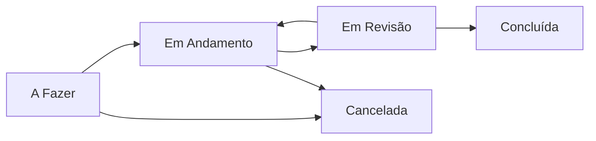

# 🗂️ TaskFlow Pro

> Sistema corporativo de gestão de tarefas desenvolvido em Django

### 🛠️ Tecnologias Usadas

As seguintes ferramentas, linguagens e bibliotecas foram utilizadas no desenvolvimento do projeto:


## ✨ Funcionalidades

### 🔐 Autenticação e Acesso
- ✅ Login e logout seguros
- ✅ Cadastro de usuários com e-mail obrigatório
- ✅ Recuperação de senha por e-mail
- ✅ Proteção de rotas — nenhuma página acessível sem login

### 👥 Perfis de Acesso
| Perfil | Flag Django | Permissões |
|--------|-------------|------------|
| Colaborador | `is_active` | Gerencia apenas suas próprias tarefas |
| Gestor | `is_staff` | Visualiza todas as tarefas |
| Admin | `is_superuser` | Acesso total + histórico de alterações |

### 📋 Gestão de Tarefas
- ✅ Criar, editar e arquivar tarefas
- ✅ Controle de status com fluxo definido
- ✅ Prioridade com destaque visual por cor
- ✅ Prazo com alertas automáticos
- ✅ Busca por título e descrição
- ✅ Filtros por status, prioridade e prazo
- ✅ Paginação de 5 em 5 tarefas

### 🚦 Fluxo de Status



### 📊 Visualizações
- ✅ Lista com filtros e busca em tempo real via HTMX
- ✅ Kanban por colunas com cards clicáveis
- ✅ Responsivo — mobile, tablet e desktop

### 🗄️ Arquivamento e Auditoria
- ✅ Tarefas concluídas e canceladas só podem ser arquivadas
- ✅ Histórico completo de alterações por usuário
- ✅ Histórico preservado mesmo após arquivamento

## 🚀 Como Rodar Localmente

### Pré-requisitos
- Python 3.14+
- Git

### Passo a passo

**1. Clonar o repositório**
```bash
git clone https://github.com/Lobato2310/task-list.git
cd task-list
```

**2. Criar e ativar o ambiente virtual**
```bash
python -m venv venv
venv\Scripts\activate  # Windows
source venv/bin/activate  # Linux/Mac
```

**3. Instalar dependências**
```bash
pip install -r requirements.txt
```

**4. Configurar o `.env`**
```bash
cp .env.example .env
# Edite o .env com suas credenciais
```

**5. Rodar as migrations**
```bash
python manage.py makemigrations
python manage.py migrate
```

**6. Criar superuser**
```bash
python manage.py createsuperuser
```

**7. Rodar o servidor**
```bash
python manage.py runserver
```

Acesse: http://127.0.0.1:8000

## 🗺️ Roadmap

| Fase | Versão | Status | Entregas |
|------|--------|--------|----------|
| 1 | MVP | ✅ Concluído | CRUD de tarefas básico |
| 2 | v1.0 | ✅ Concluído | Login, perfis de acesso, status e prioridade |
| 3 | v1.5 | ✅ Concluído | Kanban, filtros, busca, paginação, integração de e-mail |

### 🔜 Melhorias Futuras Em Planejamento — v2.0
- [ ] Dashboard com métricas gerenciais
- [ ] Relatórios por usuário e por status
- [ ] Exportação de tarefas em CSV
- [ ] Troca de banco de dados para PostgreSQL em produção
- [ ] App Mobile

## 👨‍💻 Autor

<div align="center">

**Lucas Lobato**

[](https://github.com/Lobato2310)

</div>

---

## 📄 Licença

Este projeto está sob a licença MIT. Veja o arquivo [LICENSE](LICENSE) para mais detalhes.

---

<div align="center">

**TaskFlow Pro** — Desenvolvido por Lucas Lobato

</div>